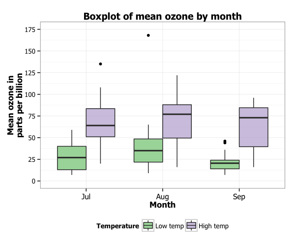
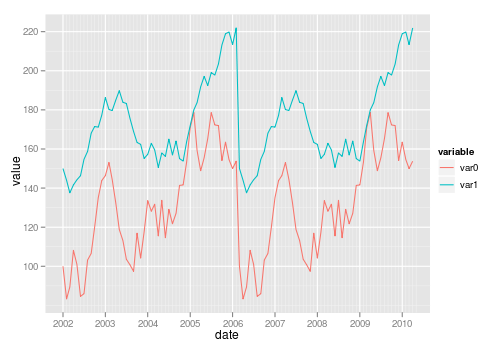
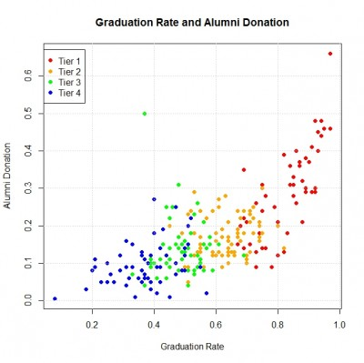

<!--
教學檔在bitbucket:
https://bitbucket.org/yeyuting/2018nccu_r/src/master/week03/
-->

```{r ,echo=FALSE,warning=FALSE,message=F}
setwd('C:/Users/ASUS/Documents/2018nccu_r/week03/')
options('scipen'=100,'digits'=2)
knitr::opts_chunk$set(comment="",prompt=F,strip.white=F,
                      warning=FALSE,message=F,echo=T,
                      fig.align='center',fig.height=3.5)
##----載入套件----
library(dplyr)
library(dygraphs)
library(ggplot2)
library(ggmap)
library(data.table)
library(devtools)
library(plotly)
library(xtable)
library(tidyr)
library(DT)
library(RColorBrewer)
library(dtplyr)
library(knitr)
library(kableExtra)
library(highcharter)
```

# 課程綱要

## Agenda

<div style="float: left; width: 40%;">
- EDA
    * 基本統計量
    * Data Visualization
- 套件
    * `ggplot2`
    * `plotly`
    * `highcharter`
</div>
<div style="float: right; width: 60%;">
- 介紹
    * 套件基本架構
    * 起手式(基本語法)
    * 應用(各種圖形的呈現)
        + `Bar`
        + `Line`
        + `Histogram`
        + `Boxplot`
        + `Point`
    * 進階技巧
</div>

## EDA
<div style="float: left; width: 50%;">
- 基本統計量
    * 整體概況 : 平均數、變異數等...
    * 離群值
- Data Visualization
    * 功能 : 
        - 探索瞭解資料
        - 清晰有效地傳達與溝通訊息
    * 目的 : 教學、研究、宣傳
    * 進階 : 美學、功能兼顧
    * 分析 : 統計圖形、訊息可視化
</div>
<div style="float: right; width: 50%; text-align:left;">

>- 
<table><tr><td bgcolor=#ffffe6>**資料視覺化**
</br></br>可以在不簡化資訊情況下，
</br>降低複雜資料的理解門檻
</br></br>幫助我們以較簡單的方式，
</br>去理解高維度</td></tr></table>

</div>

<!--
## plot type

<div style="float: left; width: 50%;">
- *備註:放各種類型的範例圖*
</img>
</img>
</img>
</div>

<div style="float: right; width: 50%;">
</img>
</img>
</div>
-->
<!--
圖片參考 : 
長條圖 https://drsimonj.svbtle.com/page/3
折線圖 http://blog.sina.cn/dpool/blog/s/blog_632721090102v1ij.html?vt=4
散布圖 https://blogs.bgsu.edu/statgraphicssishi/2013/04/19/r-package-ggplot2/
直方圖 https://de.switch-case.com/32423372
盒鬚圖 http://t-redactyl.io/blog/2016/04/creating-plots-in-r-using-ggplot2-part-10-boxplots.html

進階
地圖 http://blog.manugarri.com/making-a-beautiful-map-of-spain-in-ggplot2/
玫瑰風向圖 https://medium.com/optima-blog/using-polar-coordinates-for-better-visualization-1d337b6c9dec
-->

<!--可以放範例 : highcharter 的圖表-->

<!--
表格訊息不多，所以先考慮不放，整理過後需要再放
## 套件差異

| Tables | ggplot |  highcharter  |  plotly |
|:------:|:------:|:-------------:|:-------:|
|使用時機|        | 互動          |     互動|
| 相同   |視覺化  |   視覺化      |   視覺化|
| 讀入的資料格式不同| 長資料| 寬資料 |長資料|

-->

# ggplot

## ggplot2簡介

- R環境下的繪圖套件
- 取自"The Grammar of Graphics"(Leland Wilkinson, 2005)
- [設計理念](https://github.com/cosname/ggplot2-translation/blob/master/preface.md)
- 採用圖層系統
    - 用抽象的概念來控制圖形，避免細節繁瑣
    - 圖形美觀

## ggplot2基本架構

<div style="float: left; width: 50%;">

1. 準備
    - 資料 (data)、映射 (mapping)
2. 主要
    - 幾何對象 (`geom`etric)
    - 美學(`aes`thetic)  
3. 次要
    - 統計轉換 (`stat`istics)
    - 刻面 (`facet`)
    - 座標系統 (`coord`inante)
    - 主題 (`theme`)
</div>

<div style="float: right; width: 50%;">
</img>
</br>
</br>
</img>
</div>
<!--
3. 次要
    - 座標尺度 (`scale`)
    - 統計轉換 (`stat`istics)
    - 刻面 (`facet`)
    - 座標系統 (`coord`inante)
    - 圖層 (layer)
    - 主題 (`theme`)
-->

<!--參考 https://rpubs.com/skydome20/R-Note4-Plotting_System-->
<!--
主要
- Geometric objects (幾何屬性)：包括「點、線、盒狀圖、直條圖」等…
- Aesthetic attributes (美學表現)：包括「顏色、形狀、點的大小與線的粗細」等…
次要
- Facets：提供在同一張圖內做多個子圖的方法，只要使用Faceting功能設定子圖分類的依據參數即可- Stats：將資料做統計轉換。
- Scales：修改點線的顏色、形狀、xy軸的範圍等-->
<!--參考 https://molecular-service-science.com/2013/11/27/r-ggplot-tutorial-1/-->

## ggplot2 基本語法 

```{r eval=FALSE, echo=TRUE, message=FALSE, warning=FALSE}
ggplot(data=..., aes(x=..., y=...)) + 
  geom_xxx(...) +
  stat_xxx(...) + 
  facet_xxx(...) + ...
```

各個函數簡述 : 

- `ggplot` : 要呈現的data
- `aes` : 圖上的元素和data之間的對應關係
- `geom_xxx` : 圖的類型和其他相關調整參數
    - 常見的圖類型 : `geom_bar`, `geom_line`, `geom_points`, ...
- `stat_xxx` : 調整統計參數
- `facet_xxx` : 調整圖表呈現排列

## Various functions

```{r}
library(ggplot2)
# list all geom
ls(pattern = '^geom_', env = as.environment('package:ggplot2'))
```


## **注意**

- 使用 `data.frame` 儲存資料 (不可以丟 matrix 物件)
- 使用 `long format` (利用reshape2、tidyverse將資料轉換成1 row = 1 observation)

>- 部份情況例外，可以丟入原始資料!

</br>

<center></center>

## 畫圖前的準備

- 安裝套件
```{r eval=FALSE, echo=TRUE, message=FALSE, warning=FALSE, paged.print=FALSE}
install.packages(c("ggplot2","dplyr","tidyverse","reshape2"))
```
<!--install.packages(c("ggplot2","dplyr","tidyverse")),repos="http://cran.csie.ntu.edu.tw/")-->
</br>

- 載入套件

```{r eval=FALSE, echo=TRUE, message=FALSE, warning=FALSE, paged.print=FALSE}
library(ggplot2)
library(dplyr)
library(tidyverse)
library(reshape2)
```

</br>

- **注意**:

    - 換一台裝置時，可能需要先安裝套件~
    
    - 下載完套件一定要記得`library`才能使用喲!

## 從讀檔開始(.csv)

[實價登錄資料下載](https://drive.google.com/open?id=1VTQfBLvhBOBFMC6r9qGnmvomQWHLkhUB)、 [鐵達尼號資料下載](https://drive.google.com/open?id=1gy2PYR8SUfWIx8qsTeGIEJyIjjYyBdSS)

<!--
修改:
- fileEncoding注意
-->

```{r message=FALSE, warning=FALSE, include=FALSE, paged.print=FALSE}
transaction<-read.csv("./data/transaction.csv")
titanic<-read.csv("./data/train.csv")
```

```{r,eval=FALSE,echo=TRUE}
############### 絕對路徑 ###############
# 請輸入完整的檔案路徑
transaction <- read.csv("/Users/ASUS/Documents/2018nccu_r/week03/data/transaction.csv") #如果你是Mac,加上fileEncoding = "big5"
titanic<-read.csv("./data/train.csv")

############### 相對路徑 ###############
getwd() #知道目前自己所在的路徑
setwd("C:/Users/ASUS/Desktop") #設定成檔案下載存放的路徑
transaction <- read.csv("transaction.csv") #不須設定絕對路徑

############### 注意 ###############
# 不論哪種讀入方法出現亂碼時，試試以下fileEncoding =
transaction <- read.csv("transaction.csv",fileEncoding = "big5") #如果你是mac
transaction <- read.csv("transaction.csv",fileEncoding = "utf-8") #如果你是windows
```

## 資料欄位說明-實價登錄

```{r echo = FALSE,fig.height=3, warning=FALSE, fig.align='center', message=FALSE, results='asis'}
data.frame(`英文欄位名稱`=c("city","district","trac_year","trac_month","trac_type","trac_content","use_type","build_type","build_ymd","area_land","area_build","area_park","price_total","price_unit"),`中文欄位名稱`=c("縣市","鄉鎮市區","交易年份","交易月份","交易標的","交易筆棟數","使用分區或編定","建物型態","建築完成年月","土地移轉總面積.平方公尺.","建物移轉總面積.平方公尺.","車位移轉總面積.平方公尺.","總價.元.","單價.元.平方公尺.")) -> name
```

<div style='float:left;width:40%;'>
```{r, echo = FALSE}
name[1:7,] %>% knitr::kable()
```

</div>

<div style='float:right;width:60%;'>
```{r, echo = FALSE}
name[8:14,] -> name2
rownames(name2) <- c(1:7)
name2 %>% knitr::kable()
```

</div>

## 資料欄位說明-鐵達尼號

```{r echo = FALSE,fig.align='center', fig.height=3, message=FALSE, warning=FALSE, include=FALSE, results='asis'}

data.frame(`英文欄位名稱`=c("PassengerId","Survived","Pclass","Name","Sex","Age","SibSp","Parch","Ticket","Fare","Cabin","Embarked"),`中文欄位名稱`=c("編號","是否生存","艙等","姓名","性別","年齡","在船上的兄弟姊妹及配偶總數","在船上的父母家長及子女總數","船票編號","票價","座艙編號","登船港口")) -> name
```

<div style='float:left;width:40%;'>
```{r, echo = FALSE}
name[1:6,] %>% knitr::kable()
```

</div>

<div style='float:right;width:60%;'>
```{r, echo = FALSE}
name[7:12,] -> name2
rownames(name2) <- c(1:6)
name2 %>% knitr::kable()
```

</div>
備註 : </br>

- Survived(是否生存) : 1:是、0:否

- 登船港口 : C:瑟堡-法國城鎮、Q:皇后鎮-紐西蘭城市、S:南安普敦-英格蘭城市

## 檢視資料 - 實價登錄
```{r eval=F,echo=TRUE}
head(transaction,5)
View(transaction)
```

```{r echo=FALSE, message=FALSE, warning=FALSE, paged.print=FALSE}
head(transaction,5)
```

## 以為開始了嗎？

- 進行分析前，先去了解資料的型態與特性

```{r echo=TRUE}
str(transaction)
```

## 身為資料分析師，一定要有的好習慣！

- 暸解基本的各變數統計量值

```{r echo=TRUE}
summary(transaction)
```

# Bar chart

## Bar chart

- `geom_bar`
- 判斷資料類型 : 原始

```{r, echo = FALSE}
head(transaction)
```


## Bar chart

- `geom_bar`
- 判斷資料類型 : 長資料(整理過的資料)

```{r, echo = FALSE}
# 先轉成長資料
count_city <- transaction %>% group_by(city) %>% summarise(n= n()) %>% as.data.frame()
count_city %>% kable() 
```

## 基本架構

```{r eval=F,echo=TRUE}
# 第一種:data為原始資料
ggplot(data,aes(x=...)) +  #只放x
  geom_bar(fill="...",color = "...",stat = "count") + # fill:長條顏色、color:長條邊框顏色、stat = "count"可加可不加
  labs(title="...",x="...",y="...") # title:圖形標題,x:x軸名稱,y:y軸名稱

# 第二種 : data為長資料
ggplot(data, aes(x = reorder(...,-...),y = ...)) + #x和y的條件都有且x依y的值降冪排序
  geom_bar(fill="...",color = "...",stat = "identity") + # fill:長條顏色、color:長條邊框顏色、加stat = "identity"
  labs(title="...",x="...",y="...") # title:圖形標題,x:x軸名稱,y:y軸名稱

# 提醒 : Mac要在圖上顯示中文
thm <- function() theme(text=element_text(size = 15, family = "STHeiti")) # 控制字體與大小
    # STHeiti是只有Mac才有的字體, 用來解決Mac系統中文顯示錯誤的問題
    # Windows系統使用者請忽略 `+ thm()` 指令
```


## 基本 : 資料是**原始資料**

- ex : **計算各縣市交易筆數**
- `aes()`中<font color="red">只輸入x條件</font>時，ggplot會自動以x的分類條件計算個數count(*)

<!-- 
```{r global_options, include=FALSE}
knitr::opts_chunk$set(fig.width=12, fig.height=8, fig.path='Figs/',
                      echo=FALSE, warning=FALSE, message=FALSE)
```
--> 
 
```{r echo=TRUE, fig.align='center', fig.height=3.5, fig.width=7, message=FALSE, warning=FALSE, paged.print=FALSE}
ggplot(transaction,aes(x=city)) +  #只輸入x條件
  geom_bar() # stat = "count"預設(所以可加可不加)
```

## 基本 : 資料是**長資料**或**整理過的資料**

- ex : **計算各縣市交易筆數**
- `aes()`中<font color="red">輸入x,y條件</font>
- 在`geom_bar()`中加<font color="red">`stat = "identity"`</font> ，依給的x和y作圖
```{r eval=F,echo=TRUE, fig.align='center', fig.height=3.5, fig.width=7, message=FALSE, warning=FALSE, paged.print=FALSE}
# ---- 方法二----
# 先轉成長資料
count_city <- transaction %>% group_by(city) %>% summarise(n= n()) %>% as.data.frame()
# transaction %>% group_by(city) %>% tally() %>% as.data.frame()
# 檢視資料格式
count_city
# 匯出基本長條圖
ggplot(count_city, aes(x = city,y = n))+ #輸入x,y條件
  geom_bar(stat = "identity")# stat = "identity"
```


##

<div style='float:left;width:48%;'>
</br>
檢視資料格式
</br>
```{r, echo = FALSE}
count_city %>% knitr::kable()
```

</div>

<div style='float:right;width:50%;'>
</br>
匯出基本長條圖
</br>
</br>
```{r echo=FALSE, message=FALSE, warning=FALSE, paged.print=FALSE,fig.height=3, fig.width=5}
ggplot(count_city, aes(x = city,y = n))+ #輸入x,y條件
  geom_bar(stat = "identity")# stat = "identity"
```

</div>

## Change labels!

- `+labs(title = "...", x = "...", y = "...")` : 
    - 圖形標題、x,y座標軸名稱

```{r echo=TRUE, fig.align='center', fig.height=3.3, fig.width=6.5, message=FALSE, warning=FALSE, paged.print=FALSE}
ggplot(transaction,aes(x=city)) +
  geom_bar(stat = "count") +
  labs(title="各縣市交易量",x="縣市",y="交易量")
```

## Change colors!

- 顏色調整：`color` vs `fill`?
    - `geom_bar(fill="長條顏色", color="長條邊框顏色")`
```{r echo=TRUE, fig.align='center', fig.height=3.3, fig.width=6.5, message=FALSE, warning=FALSE, paged.print=FALSE}
ggplot(transaction,aes(x=city)) +
  geom_bar(fill="snow", color="black",stat = "count") +
  labs(title="各縣市交易量",x="縣市",y="交易量")
```

## Reoder x
- `aes(x = reorder(x變數,-y變數),...)` : x可依y的值降冪排序
```{r echo=TRUE, fig.align='center', fig.height=3.3, fig.width=6.5, message=FALSE, warning=FALSE, paged.print=FALSE}
ggplot(count_city, aes(x = reorder(city,-n),y = n))+ #x = reorder(city,-n)
  geom_bar(fill="snow", color="black",stat = "identity") + 
  labs(title="各縣市交易量",x="縣市",y="交易量")
```


<!-- x可依特定排序
## Reoder x
- `aes(x = reorder(x變數,c("...",...,"...")),...)` : x可依特定排序
```{r echo=TRUE, fig.align='center', fig.height=3.3, fig.width=6.5, message=FALSE, warning=FALSE, paged.print=FALSE}
ggplot(count_city, aes(x=reorder(city,c("臺北市","新北市","臺中市","高雄市")),y = n))+ #x = reorder(city,-n)
  geom_bar(fill="snow", color="black",stat = "identity") + 
  labs(title="各縣市交易量",x="縣市",y="交易量")
```
-->

<!--
## 小挑戰
- ex : 看臺北市各行政區的交易量
    - 標題、x,y座標軸名稱
    - 行政區由多至少排列
    - 更改顏色

>- hint : 資料處理

>- 先抓出臺北市資料，計算數量

>- `filter`、`group_by`、 `summarise`

>- 整理成**長資料**

-->

## 小挑戰
- ex : 看鐵達尼號的資料生存者中各艙等的人數
    - 標題、x,y座標軸名稱
    - 各艙等依人數由多至少排列
    - 更改顏色

>- hint : 檢視原始資料

>- `View()`、`str()`、`summary()`

>- hint : 資料處理

>- 先抓出生存者資料，再計算各艙等數量

>- `filter`、`group_by`、 `summarise`

>- 整理成**長資料**

<!--
## 參考解答

第一步 : 

- 整理資料

- 檢視資料格式

```{r echo=TRUE, message=FALSE, warning=FALSE, paged.print=FALSE}
# 資料整理
count_taipei <- transaction %>% 
  filter(city=="臺北市") %>% 
  group_by(district) %>% 
  summarise(n= n())
```
-->

<!--問題!!!:表格呈現不出來，不知道原因-->
<!--
<div style='float:right;width:50%;'>
</br>
```{r, echo = FALSE}
count_taipei %>% kable()
```
</div>
-->


## 參考解答

第一步 : 

- 整理資料

- 檢視資料格式

<div style="float: left; width: 50%;">
```{r echo=TRUE, message=FALSE, warning=FALSE, paged.print=FALSE}
count_class <- titanic %>% 
  filter(Survived=="1") %>% 
  # 抓出生存者
  group_by(Pclass) %>%
  # 以艙等分組
  summarise(n= n()) %>% 
  # 以分組計算各別數量
  as.data.frame()
```
</div>

<div style="float: right; width: 50%;">

```{r, echo = FALSE}
print(count_class)
```
</div>

<!--
##

```{r, echo = FALSE,results='asis'}
count_taipei %>% knitr::kable()
```
-->
<!--
## 參考解答


```{r echo=TRUE, fig.height=3.5, fig.width=6, message=FALSE, warning=FALSE, paged.print=FALSE}
ggplot(count_taipei, aes(x = reorder(district,-n),y = n))+ 
  geom_bar(fill="snow", color="black",stat = "identity") + 
  labs(title="台北市各行政區交易量",x="行政區",y="交易量")
```
-->
## 參考解答


```{r echo=TRUE, fig.height=3.5, fig.width=6, message=FALSE, warning=FALSE, paged.print=FALSE}
count_class %>% ggplot(aes(x = reorder(Pclass,-n),y = n))+ 
  geom_bar(fill="snow", color="black",stat = "identity") + 
  labs(title="各艙等中生存人數",x="艙等",y="人數")
```

## Group Data

- 類別位置調整
    - 類別堆疊、類別並排

<div style="float: left; width: 50%;">
- 類別堆疊
```{r message=FALSE, warning=FALSE, include=FALSE, paged.print=FALSE}
count_city_use <- 
  transaction %>% group_by(city,use_type) %>% summarise(n_1= n()) %>% as.data.frame()
count_city_use <- 
  merge(count_city_use,count_city,all.x = T) %>% 
  mutate(rate = round((n_1/n),3)) %>% 
  arrange(city,-rate)
```

```{r echo=F, fig.height=3.5, fig.width=5, message=FALSE, warning=FALSE, paged.print=FALSE}
# stack類別堆疊(標準)
ggplot(count_city_use ,aes(x = city, y = rate, fill = reorder(use_type,rate))) +
  geom_bar(stat = "identity", position = "stack")+
  labs(title="各縣市各別使用分區的交易量",x="縣市",y="交易量") +
  scale_fill_manual(name = "使用分區或編定", values = c("#FFCDB2", "#FFB4A2", "#E5989B","#B5838D","#6D6875")) #設定圖例名稱,圖例顏色
```

</div>

<div style="float: right; width: 50%;">
- 類別並排

```{r echo=FALSE, fig.height=3.5, fig.width=5, message=FALSE, warning=FALSE, paged.print=FALSE}
# dodge類別並排
ggplot(count_city_use , aes(x = city, y = rate, fill = reorder(use_type,rate))) +
  geom_bar(stat = 'identity', position = "dodge")+
  scale_fill_manual(name = "使用分區或編定",values = c("#FFCDB2", "#FFB4A2", "#E5989B","#B5838D","#6D6875"))+#設定圖例顏色 
  labs(title="各縣市各別使用分區交易量",x="縣市",y="交易量") 
```

</div>    

## 

- 基本架構
```{r echo=TRUE,eval=FALSE, message=FALSE, warning=FALSE, paged.print=FALSE}
# 第一種 : 類別堆疊
ggplot(data, aes(x = reorder(...,-...),y = ...,fill = reorder(...,...)) + 
  geom_bar(position = "stack") + #位置調整
  labs(title="...",x="...",y="...")+
  scale_fill_manual(name = "...",values = c("...",..., "..."))# 調整圖例名稱、顏色

# 第二種 : 類別並排
ggplot(data, aes(x = reorder(...,-...),y = ...),fill = reorder(...,...)) +
  geom_bar(position = "dodge") + #位置調整
  labs(title="...",x="...",y="...")+
  scale_fill_manual(name = "...",values = c("...",..., "...")) # 調整圖例名稱、顏色
```

## 檢視資料格式
- **ex : 計算各縣市依使用分區的交易量比例**
    - x : 縣市、y : 交易比例、**分組 : 使用分區**
    
```{r echo=T,message=FALSE, warning=FALSE, paged.print=FALSE}
count_city_use <- 
  transaction %>% group_by(city,use_type) %>% summarise(n_use= n()) %>% as.data.frame()
count_city_use <- 
  merge(count_city_use,count_city,all.x = T) %>% 
  mutate(rate = round((n_use/n),3)) %>% 
  arrange(city,-rate)
```

```{r echo=FALSE, message=FALSE, warning=FALSE, paged.print=FALSE}
count_city_use[c(1:10),] %>% kable()
```

## Grouping：`stack`

- `aes(...,fill=分組的變數)`
- `geom_bar(stat = "identity", position = "stack")`

```{r echo=T,message=FALSE, warning=FALSE, paged.print=FALSE, fig.align='center', fig.height=3.3, fig.width=6.5}
# stack類別堆疊(標準)
ggplot(count_city_use ,aes(x = city, y = rate, fill = use_type)) +
  geom_bar(stat = "identity", position = "stack")+
  labs(title="各縣市各別使用分區的交易量",x="縣市",y="交易量")
```

## Grouping：`dodge`

- `aes(...,fill=分組的變數)`
- `geom_bar(stat = "identity", position = "dodge")`

```{r echo=T,message=FALSE, warning=FALSE, paged.print=FALSE, fig.align='center', fig.height=3.3, fig.width=6.5}
# dodge類別並排
ggplot(count_city_use , aes(x = city, y = rate, fill = use_type)) +
  geom_bar(stat = 'identity', position = "dodge")+
  labs(title="各縣市各別使用分區交易量",x="縣市",y="交易量") 
```

## Grouping：reorder (類別堆疊)

- stack類別堆疊
- `aes(...,fill = reorder(分組變數,y變數))` : 分組顏色可依y的值排序

```{r echo=T,message=FALSE, warning=FALSE, paged.print=FALSE, fig.align='center', fig.height=3.3, fig.width=6.5}
# stack類別堆疊(標準)
ggplot(count_city_use ,aes(x = city, y = rate, fill = reorder(use_type,rate))) +
  geom_bar(stat = "identity", position = "stack")+
  labs(title="各縣市各別使用分區的交易量",x="縣市",y="交易量")
```

## Grouping：reorder (類別並排)

- dodge類別並排
- `aes(...,fill = reorder(分組變數,y變數))` : 分組顏色可依y的值排序

```{r echo=T,message=FALSE, warning=FALSE, paged.print=FALSE, fig.align='center', fig.height=3.3, fig.width=6.5}
# dodge類別並排
ggplot(count_city_use , aes(x = city, y = rate, fill = reorder(use_type,rate))) +
  geom_bar(stat = 'identity', position = "dodge")+
  labs(title="各縣市各別使用分區交易量",x="縣市",y="交易量") 
```

## Grouping：Change colors! (類別堆疊)

- `scale_fill_manual(name = "...", values = c("...", ...,"..."))` : 設定圖例名稱、圖例顏色

```{r echo=T,message=FALSE, warning=FALSE, paged.print=FALSE, fig.align='center', fig.height=3.3, fig.width=6.5}
ggplot(count_city_use ,aes(x = city, y = rate, fill = reorder(use_type,rate))) +
  geom_bar(stat = "identity", position = "stack")+
  labs(title="各縣市各別使用分區的交易量",x="縣市",y="交易量") +
  scale_fill_manual(name = "使用分區或編定", values = c("#FFCDB2", "#FFB4A2", "#E5989B","#B5838D","#6D6875")) #設定圖例名稱,圖例顏色
```

## Grouping：Change colors! (類別並排)

- `scale_fill_manual(name = "...", values = c("...", ...,"..."))` : 設定圖例名稱、圖例顏色

```{r echo=T,message=FALSE, warning=FALSE, paged.print=FALSE, fig.align='center', fig.height=3.3, fig.width=6.5}
ggplot(count_city_use , aes(x = city, y = rate, fill = reorder(use_type,rate))) +
  geom_bar(stat = 'identity', position = "dodge")+
  labs(title="各縣市各別使用分區交易量",x="縣市",y="交易量")+
  scale_fill_manual(name = "使用分區或編定",values = c("#FFCDB2", "#FFB4A2", "#E5989B","#B5838D","#6D6875"))#設定圖例名稱顏色 
```

## 小挑戰

- **ex : 看鐵達尼號的資料各艙等生存和非生存的人數**
    - 標題、x,y座標軸名稱</br>
          x : 艙等、y:人數、分組:生存(1:是、0:否)
    - 並排方式
   
>- hint : 資料處理

>- `group_by`、 `summarise`

>- hint : 資料繪圖

>- 注意 : `fill = factor(Survived)`


<!--
- **ex : 看鐵達尼號的資料不同性別的生存和非生存的人數**
    - 標題、x,y座標軸名稱</br>
          x : 性別、y:比例、分組:生存(1:是、0:否)
    - 堆疊方式
-->

## 參考解答
<div style="float: left; width: 50%;">
```{r echo=TRUE}
table<- titanic %>% 
  group_by(Pclass,Survived) %>% 
  summarise(n=n()) %>% 
  as.data.frame()
```
</div>
<div style="float: right; width: 50%;">

```{r echo=F}
table 
```
</div>

## 參考解答

```{r echo=TRUE, fig.height=3.7, fig.width=6.5}
table %>% ggplot(aes(x = Pclass, y = n, fill = factor(Survived))) + #注意Survived本身數值,要轉成factor
  geom_bar(stat = "identity", position = "dodge") +
  labs(title="各艙等生存和非生存人數",x="艙等",y="人數") +
  scale_fill_manual(name = "是否生存", values = c("#5A76A2", "#619D70")) 
```

## How to choose colors?

- [http://colorbrewer2.org/](http://colorbrewer2.org/)
- [http://colorsupplyyy.com/app/](http://colorsupplyyy.com/app/)
- [https://coolors.co/](https://coolors.co/)


# Line chart

## Line chart

- data : 長資料

- `geom_line`

- 參數調整
    - **`group`**、**顏色**、座標軸範圍

- 注意 : 
    
    x座標上的都是**類別變數**非連續變數，例如:月份、年份...
    
    所以如果x要放置的為數字要改成<font color="red">`factor()`</font>
    
## 基本架構

```{r eval=F,echo=TRUE}
# 第一種:單條線
ggplot(data,aes(x=...,y=...,group=1)) + #aes(...,group=1)
  geom_line(color = "...") + #只有一條線時的顏色更改
  labs(title = "...",x = "..." , y = "...")+ 
  coord_cartesian(ylim = c(...,...))) #座標軸範圍

# 第二種 : 多條線
  ggplot(data,aes(x=...,y=...,group=...,color=...)) +
  geom_line() + 
  geom_point() + #加點
  labs(title = "...",x = "..." , y = "...")+
  coord_cartesian(ylim = c(...,...))) #座標軸範圍
  scale_colour_manual(values = c("...",...,"...")) #改變顏色
```


## 基本 : Single Line

- ex : 計算臺北市各月分的交易量

- 檢視資料 : 

<div style="float: left; width: 50%;">
```{r echo=TRUE, message=FALSE, warning=FALSE, paged.print=FALSE}
transaction$trac_month <- 
  factor(transaction$trac_month)

count_month_taipei <- 
  transaction %>% 
  filter(city == "臺北市" ) %>% 
  group_by(trac_month) %>% 
  summarise(n = n()) %>% 
  as.data.frame()
```
</div>

<div style="float: right; width: 50%;">
```{r echo=FALSE, message=FALSE, warning=FALSE, paged.print=FALSE}
count_month_taipei
```
</div>


##

- 注意 : 

    - 只有一條線的情形 : 
   
        - 在`aes()`中要加<font color="red">`group=1`</font>，不然不會顯示線
    
        - 顏色更改 : 在`geom_line()`中加`color = "..."`
    
```{r eval=F,echo=TRUE}
count_month_taipei %>% 
  ggplot(aes(x=trac_month,y=n,group=1)) + #aes(...,group=1)
  geom_line(color = "#006BA6") + #顏色更改
  labs(x = "交易月份" , y = "交易數量",title = "臺北市各月份的交易量")+ 
  coord_cartesian(ylim = c(min(count_month_taipei$n), max(count_month_taipei$n))) #座標軸範圍
```

##
</br>
- ex : 計算臺北市各月分的交易量
</br>
</br>
</br>
```{r echo=FALSE, fig.align='center', fig.height=4, fig.width=7}
count_month_taipei %>% 
  ggplot(aes(x=trac_month,y=n,group=1)) + #aes(...,group=1)
  geom_line(color = "#006BA6") + #顏色更改
  labs(x = "交易月份" , y = "交易數量",title = "臺北市各月份的交易量")+ 
  coord_cartesian(ylim = c(min(count_month_taipei$n), max(count_month_taipei$n))) #座標軸範圍
```


## 基本 : `Multiple` Line 

- ex : 呈現各縣市各月份的交易量

檢視資料:

```{r echo=TRUE}
count_month <- transaction %>% group_by(city,trac_month) %>% summarise(n = n()) %>% as.data.frame()
```

##

<div style="float: left; width: 50%;">

```{r echo=FALSE, message=FALSE, warning=FALSE, paged.print=FALSE}
count_month[c(1:12),] %>% kable()
```

</div>

<div style="float: right; width: 50%;">

```{r echo=FALSE, message=FALSE, warning=FALSE, paged.print=FALSE}
count_month[c(13:24),] %>% kable()
```

</div>

##
注意 : 

- 很多條線的情形 : 

    - 顏色依變數區分:`aes(...,group=分組的變數,color=分組的變數)`
    
    - 顏色的選擇 : `scale_colour_manual(values =c(...))`

```{r eval=F,echo=TRUE,message=FALSE, warning=FALSE, paged.print=FALSE}
count_month %>% 
  ggplot(aes(x=trac_month,y=n,group=city,color=city)) + #group=分組的變數,color=分組的變數
  geom_line() + 
  geom_point() + #加點
  labs(x = "交易月份" , y = "交易數量",title = "各縣市各月份的交易量")+
  coord_cartesian(ylim = c(min(count_month$n), max(count_month$n)))+
  scale_colour_manual(values = c("#006BA6", "#FFBC42", "#D81159","#8F2D56"))#顏色的選擇
  
```

## 
</br>
- ex : 呈現各縣市各月份的交易量
</br>
</br>
</br>
```{r echo=FALSE, fig.align='center', fig.height=4, fig.width=7, message=FALSE, warning=FALSE, paged.print=FALSE}
count_month %>% 
  ggplot(aes(x=trac_month,y=n,group=city,color=city)) + #group=分組的變數,color=分組的變數
  geom_line() + 
  geom_point() + #加點
  labs(x = "交易月份" , y = "交易數量",title = "各縣市各月份的交易量")+
  coord_cartesian(ylim = c(min(count_month$n), max(count_month$n)))+
  scale_colour_manual(values = c("#006BA6", "#FFBC42", "#D81159","#8F2D56"))#顏色的選擇
  
```
<!--
## 小挑戰

## 參考解答
-->

# Histogram

## 基本架構

- 資料:原始資料

- `aes(y=..count..)` vs. `aes(y=..density..)`
      
      前後點點皆不可省略，為了區隔資料中的變數

- `geom_histogram` v.s. `geom_density`

## 基本 : Histogram

- ex : **交易房屋的屋齡狀況**

- `aes(...,y = ..count..)`

- `geom_histogram(color="...",fill = "...",binwidth = ...)`

```{r echo=TRUE,message=FALSE, warning=FALSE, paged.print=FALSE, fig.align='center', fig.height=3, fig.width=6}
transaction %>% ggplot(aes(x=age, y =..count..)) + 
  geom_histogram(color="grey",fill = "steelblue",binwidth = 5) #長條邊框顏色,長條顏色、長條寬度
```


## 基本 : 機率密度圖

- ex : **交易房屋的屋齡狀況**

- `aes(...,y = ..density..)`

- `geom_density(color="...",fill = "...",alpha = ...)`

```{r echo=TRUE,message=FALSE, warning=FALSE, paged.print=FALSE, fig.align='center', fig.height=3, fig.width=6}
# 機率密度圖
transaction %>% ggplot(aes(x=age, y =..density..)) + 
  geom_density(fill = "steelblue",alpha = 0.2,color="darkgrey") # alpha設定透明度
```

## Histogram + density

- `geom_histogram()` + `geom_density()`

- 疊圖的時候，注意 `aes(...,y=..density..)`

```{r echo=TRUE,message=FALSE, warning=FALSE, paged.print=FALSE, fig.align='center', fig.height=3.3, fig.width=6.5}
transaction %>% ggplot(aes(x=age,y=..density..)) + 
  geom_histogram(color="black", fill="white") +
  geom_density(alpha=.2, fill="#FF6666") 
```

## 小挑戰

- **ex : 鐵達尼號資料生存者的年齡概況**

>- hint : 資料處理

>- `filter`

>- hint : 直方圖、密度圖

>- `geom_histogram`、`geom_density`

## 參考解答

```{r echo=TRUE,message=FALSE, warning=FALSE, paged.print=FALSE, fig.align='center', fig.height=3.3, fig.width=6.5}
titanic %>% filter(Survived==1) %>% 
  ggplot(aes(x=Age,y=..density..)) + 
  geom_histogram(color="black", fill="white") +
  geom_density(alpha=.2, fill="#FF6666") 
```
<!--
## 補充 - 依group畫直方圖或密度圖
http://www.cookbook-r.com/Graphs/Plotting_distributions_(ggplot2)/
```{r}
data<-data.frame(type=c(rep("x",100),rep("y",100)),sample=c(rnorm(100,0,1),rnorm(100,2,1)))
data %>%
  ggplot(aes(x=sample,y=..density..,fill=type)) + 
  geom_density(alpha=0.2)+
  scale_fill_manual(values = c("pink","blue"))
```
-->

# Boxplot 

## Boxplot 

- `geom_boxplot`

- 資料 : 原始資料

##

- ex:**呈現各縣市每平方公尺價格**

- 基本盒鬚圖

```{r echo=TRUE,message=FALSE, warning=FALSE, paged.print=FALSE, fig.align='center', fig.height=3.3, fig.width=6.5}
transaction %>% ggplot(aes(x=city,y=price_unit)) + 
  geom_boxplot() + 
  labs(title="各縣市每平方公尺價格",x = "縣市" , y = "每平方公尺價格(元)")
```

## 離群值

注意 : 

- `outlier.shape=NA`只是隱藏離群值但不會刪去離群值

    但座標軸範圍仍維持原本，<font color = "red">建議更改座標軸範圍</font>
    
```{r eval=F,echo=T,message=FALSE, warning=FALSE, paged.print=FALSE}
na.exclude(transaction) %>% ggplot(aes(x=city,y= price_unit)) + 
  geom_boxplot(outlier.shape=NA) + #outlier不顯示
  labs(x = "縣市" , y = "每平方公尺價格(元)")+
  coord_cartesian(ylim=c(0,400000)) #座標軸範圍
```

##

<div style="float: left; width: 50%;">

</br>

- 隱藏離群值，沒更改y的座標軸

</br>

```{r echo=F,message=FALSE, warning=FALSE, paged.print=FALSE,fig.height=3.5, fig.width=5}
na.exclude(transaction) %>% ggplot(aes(x=city,y= price_unit)) + 
  geom_boxplot(outlier.shape=NA) + #outlier不顯示
  labs(title="各縣市每平方公尺價格",x = "縣市" , y = "每平方公尺價格(元)")
```
</div>
<div style="float: right; width: 50%;">

</br>

- 隱藏離群值，有更改y的座標軸

</br>

```{r echo=F,message=FALSE, warning=FALSE, paged.print=FALSE,fig.height=3.5, fig.width=5}
na.exclude(transaction) %>% ggplot(aes(x=city,y= price_unit)) + 
  geom_boxplot(outlier.shape=NA) + #outlier不顯示
  labs(title="各縣市每平方公尺價格",x = "縣市" , y = "每平方公尺價格(元)")+
  coord_cartesian(ylim=c(0,400000)) #座標軸範圍
```
</div>


## 小挑戰
- **ex: 檢視各船艙和各登船港口票價關係**
    - 隱藏離群值
    - 改變y座標

>- hint : 

>- x:登船港口、y:票價、分組:船艙

## 參考解答
```{r echo=TRUE, fig.width=5, ,fig.height=3.5}
titanic %>% filter(Embarked %in% c("C","Q","S")) %>% 
  ggplot(aes(x = Embarked, y = Fare, fill = factor(Pclass))) +
  geom_boxplot(outlier.shape=NA) +
  labs("各船艙和各登船港口的票價",x = "登船港口" , y = "票價")+
  coord_cartesian(ylim=c(0,175))+
  scale_fill_manual(name="艙等",values=c("#006BA6", "#FFBC42", "#D81159"))
```


# Scatter plot

## Scatter plot

- `geom_point(shape,size)`

- 基本散佈圖

```{r echo=TRUE, fig.align='center', fig.height=3.3, fig.width=6.5, message=FALSE, warning=FALSE}
ggplot(iris , aes(x=Sepal.Length, y=Petal.Length)) + 
  geom_point(shape=2, size=2) # shape控制圖示；size控制點的大小
```


## point shape types 

<!--
<center></img></center>
-->
- 可以更改點的形狀
</br>
</br>
</br>
```{r echo=FALSE, message=FALSE, warning=FALSE, paged.print=FALSE, fig.align='center', fig.height=4, fig.width=10}
plot(c(1:25),rep(0,25),pch=c(1:25),cex=3,main = "",xlab = "",ylab = "")
text(c(1:25),rep(0.3,25),c(1:25))
```

## 依變數改變顏色和形狀

- 顏色、形狀、大小依指定變數:`aes(...,color = 變數,shape = 變數,size = 變數)`
    
- 顏色的選擇 : `scale_color_manual(values =c(...))`

- 形狀的選擇 : `scale_shape_manual(values =c(...))`

- 大小的選擇 : `scale_size_manual(values =c(...))`

##
```{r echo=TRUE, fig.align='center', fig.height=4, fig.width=7}
iris %>% 
  ggplot(aes(x=Sepal.Length, y=Petal.Length, 
             color=Species, shape = Species, size = Species)) + 
  geom_point() +
  scale_color_manual(values=c("#006BA6", "#FFBC42", "#D81159"))+ #控制顏色
  scale_shape_manual(values=c(1,5,7)) +  # 控制 shape 
  scale_size_manual(values=c(1,2,3))   # 控制圖示 size 
```
<!--
## 小挑戰

## 參考解答
-->

# 進階技巧

## 輔助線

- 加上輔助線

    - `geom_abline(slope,intercept = y截距)`
    
    - `geom_vline(xintercept = x截距)`
    
    - `geom_hline(yintercept = y截距)`
    
    - x截距:和x軸相交的x座標
    
    - y截距:和y軸相交的y座標
    
## 輔助線

```{r echo=T, fig.align='center', fig.height=3.3, fig.width=6.5}
norm<-data.frame(x = seq(-3,3,0.01),y = pnorm(seq(-3,3,0.01)))
norm %>% 
  ggplot(aes(x,y)) + 
  geom_point() + 
  geom_hline(yintercept = c(0,1),color = "grey",linetype = "dashed", size = 1)+
  #geom_vline(xintercept = c(0),color = "darkgrey",linetype = "dashed", size = 1)+
  labs(title="N(0,1) CDF ")
```

## `stat`istics- 畫迴歸線

```{r echo=TRUE,message=FALSE, warning=FALSE, paged.print=FALSE, fig.align='center', fig.height=3.3, fig.width=6.5}
ggplot(iris , aes(x = Sepal.Length, y = Petal.Length)) + 
  geom_point() +
  stat_smooth(method=lm, level=.95) # 可以加se=FALSE,則不顯示信賴區間
```

## `facet`

- `facet_wrap( ~ 指定變數 , nrow)`

- 比較各縣市在各月份下的交易量

```{r echo=TRUE,message=FALSE, warning=FALSE, paged.print=FALSE, fig.align='center', fig.height=3.3, fig.width=6.5}
count_month %>% ggplot(aes(x = trac_month, y = n ,fill = city))+
  geom_bar(stat='identity') + 
  labs(x = "交易月份" ,y="交易量")+
  facet_wrap( ~ city , nrow = 2)
```

## `coord`_flip()

- 座標軸翻轉

```{r echo=TRUE,message=FALSE, warning=FALSE, paged.print=FALSE, fig.align='center', fig.height=3.3, fig.width=6.5}
count_month %>%  ggplot(aes(x = trac_month, y = n ,fill = city))+
  geom_bar(stat='identity')  +
  facet_wrap( ~ city , nrow = 2) +
  labs(x = "交易月份" ,y="交易量") +
  coord_flip() 
```

## 圖形輸出

- 利用RStudio UI介面存擋
- 畫完圖之後，再存檔~~

>- 記得確認目前路徑

```{r echo=TRUE,eval=FALSE}

ggsave('檔案名稱')
ggsave('路徑/檔案名稱')

ggsave("plot.pdf", width = 4, height = 4) #pdf,png,jpeg
```

